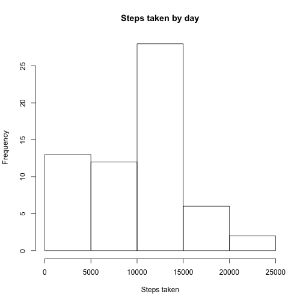
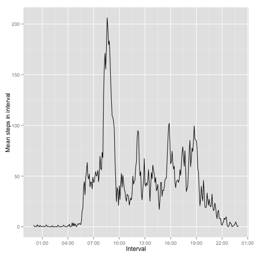
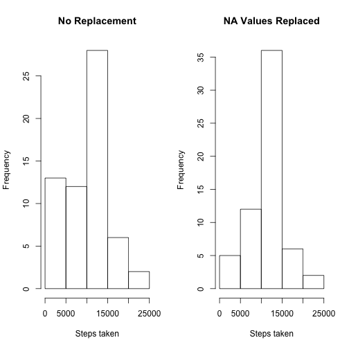
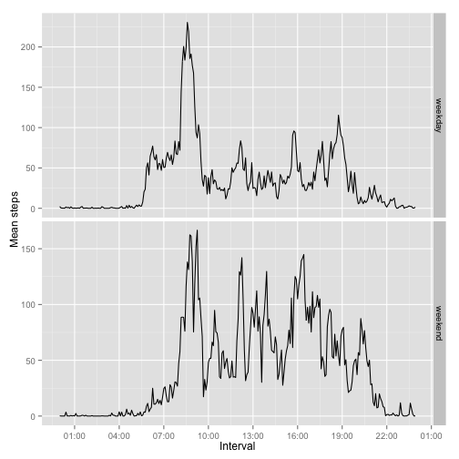

## Loading and preprocessing the data

```r
library(ggplot2); library(scales); library(gridExtra)
df = read.csv('./activity.csv')
```

## What is mean total number of steps taken per day?

```r
steps = sapply(split(df, df$date), function(x) {
  sum(x$steps, na.rm=T)
})
summary(steps)
```

```
##    Min. 1st Qu.  Median    Mean 3rd Qu.    Max. 
##       0    6778   10400    9354   12810   21190
```

```r
sd(steps)
```

```
## [1] 5405.895
```


```r
hist(steps, main="Steps taken by day", xlab="Steps taken")
```

 

We can see most step measurements are between 10000-15000 while many measurements are slightly lower, and a few are higher. We can see that 75% of days people take 12800 or less steps. Our standard deviation is also quite high -- there is a large distribution.

The mean is around `9354` while the median is slightly higher around `10400`.

## What is the average daily activity pattern?

```r
avg = sapply(split(df, df$interval), function(x) {
  mean(x$steps, na.rm=T)
})
df$interval = strptime(sprintf("%04s", as.character(df$interval)), format="%H%M")
# format intervals as dates
intervals = unique(df$interval)

data = data.frame(intervals=intervals, avg=avg)

ggplot(data, aes(intervals, avg)) + geom_line() + scale_x_datetime(breaks=("3 hour"), labels=date_format("%H:%M")) + xlab("Interval") + ylab("Mean steps in interval")
```

 

```r
### Calculate the Max Interval
format(data$interval[which.max(data$avg)], "%H:%M")
```

```
## [1] "08:35"
```

One can see the distribution of steps during the day, a particularly noticable peak is around `8:35` during the morning hours where people start their day.

## Imputing missing values
Here we used the `mean` of the data for each interval to fill in the `NA` values.

```r
# Number of missing values
length(which(is.na(df$steps)))
```

```
## [1] 2304
```

```r
# Fill in the missing values with the median of that day, in that given interval.
for (i in 1:length(df$steps)) {
  if (is.na(df$steps[i])) {
    int = df$int[i]
    # fill in data with the mean we calculated previously.
    df$steps[i] <- data[data$int == int,]$avg
  }
}

# no more na values
which(is.na(df$steps))
```

```
## integer(0)
```

```r
# aggregate by day again
new_steps = sapply(split(df, df$date), function(x) {
  sum(x$steps, na.rm=T)
})

# analyze data new data..
summary(new_steps)
```

```
##    Min. 1st Qu.  Median    Mean 3rd Qu.    Max. 
##      41    9819   10770   10770   12810   21190
```

```r
summary(steps)
```

```
##    Min. 1st Qu.  Median    Mean 3rd Qu.    Max. 
##       0    6778   10400    9354   12810   21190
```

```r
par(mfrow=c(1,2))
hist(steps, main="No Replacement", xlab="Steps taken")
hist(new_steps, main="NA Values Replaced", xlab="Steps taken")
```

 

The data looks quite different with na values replaced, we can see that our middle peak has become much higher as it is influenced by the average. Relatively, there are also less 0 values. It seems as though our `median` and `mean` are both slightly higher after incorporating the NA values.

## Are there differences in activity patterns between weekdays and weekends?

```r
df$day = weekdays(as.Date(df$date))
df$day[df$day  %in% c('Saturday','Sunday') ] <- "weekend"
df$day[df$day != "weekend"] <- "weekday"
df$day = as.factor(df$day)
df$int = format(df$interval, "%H:%M")

data <- aggregate(steps ~ int + day, df, mean)
data$int = strptime(data$int, format="%H:%M")

ggplot(data, aes(int, steps)) + geom_line() + scale_x_datetime(breaks=("3 hour"), labels=date_format("%H:%M")) + xlab("Interval") + ylab("Mean steps") + facet_grid(day ~ ., scale="free")
```

 

It appears that on the weekend there are fewer early risers, with overall higher activity throughout the day than on weekdays.  
